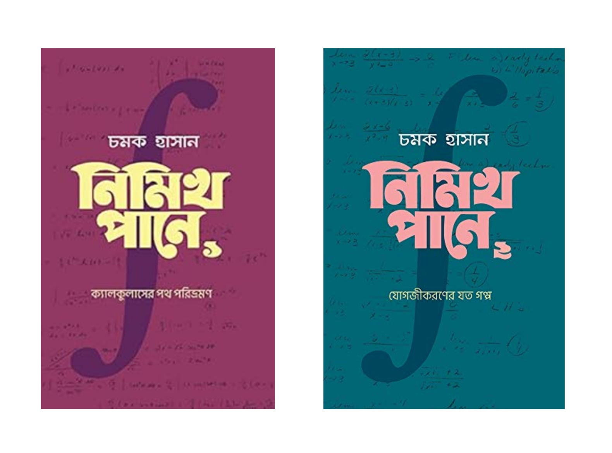

## বইপত্র

## নিমিখ পানে ১ ও ২

যদি ক্যালকুলাস শুরু করতে সমস্যা হয়, তবে এই দুটো বই খুবই কাজে দেবে। গণিত ‘বোঝা’ আর ‘অনুভব করা’— দুটো যে ভিন্ন মাত্রার বিষয়, সেটা এই দুটো বই পড়ে ভালোভাবেই উপলব্ধি করতে পারবেন আশা করি।

চমক হাসানের সাথে আমার প্রথম দেখা [ইউটিউবে](https://youtube.com/@ChamokHasan), তারপর ওনার থেকে অনুপ্রাণিত হয়ে আমারও গণিতের প্রতি একটা ভালোবাসা জন্মে যায়। ওনার ভিডিও এবং অন্যান্য বইগুলোতে গণিতের চমৎকার কিছু উপস্থাপনা দেখতে পারবেন।

